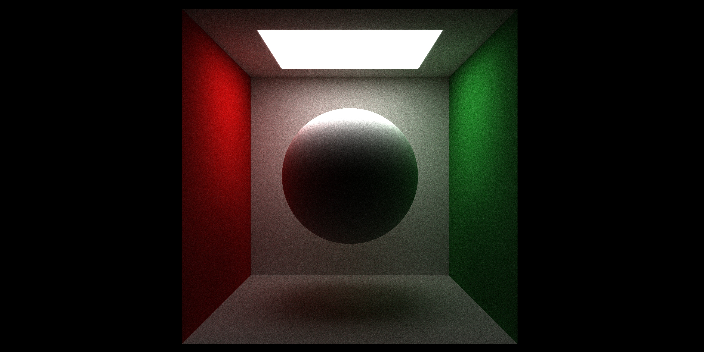

# MrRay


Meet MrRay (pronounced "Mister Ray") – a passion-driven path-tracing renderer 
that began as a hobby and now has taken on a life of its own. It's the result 
of my fascination with physically based rendering and has turned into a creative
sandbox where I tinker with various algorithms and ideas. What started as an 
adventure inspired by the 
["Ray Tracing in One Weekend"](https://github.com/RayTracing/raytracing.github.io) 
book series has now blossomed into something entirely unique.

## USD Hydra support

Rather than developing a custom scene description format exclusive to the engine,
I've chosen to create a "USD Hydra render delegate" instead. This strategic 
decision empowers MrRay to function as a renderer for any software capable of 
channeling scene description to Hydra. This approach not only removes the need 
for crafting individual translators for each software I intend to integrate 
MrRay with but also streamlines its compatibility across multiple platforms.


I've developed a dedicated plugin for Blender, seamlessly integrating MrRay as
a render delegate. You can find the plugin in a separate repository called
[MrRayBlenderAddon](https://github.com/lijenicol/MrRayBlenderAddon). Notably, 
the rendered image you see above, showcasing Pixar's kitchen set, was generated 
within Blender using MrRay at a sampling rate of 150 samples per pixel. The 
entire rendering process concluded in approximately 13 minutes.

For more information on Hydra, Pixar has a good presentation 
[here](https://openusd.org/files/Siggraph2019_Hydra.pdf)

## Cornell box demo

To test out MrRay, I have developed a quick demo application which renders a
slightly modified "Cornell box" scene.

The following command:

```
mrRayDemo --width 3996 --height 2000 --spp 600 output.jpg
```

Produces this raw image:



## Requirements

- Core dependencies:
  - `OpenImageIO` (tested against `v2.4.12.0`)
- Cornell box demo dependencies:
  - `argparse` (tested against `v2.9`)
- Hydra render delegate dependencies:
  - `OpenUSD` (tested against `v23.05`)

## Building

MrRay uses CMake for its build system. The following options are available:

- `MR_RAY_BUILD_HYDRA` - controls whether to build the MrRay Hydra render delegate
  (off by default)
- `MR_RAY_BUILD_DEMO` - controls whether to build the Cornell box demo
  (off by default)
- `ARGPARSE_INCLUDE_DIR` - path to the `argparse` include directory

### Example build/install

Run the commands below inside your build directory to install MrRay. A successful 
build is not guaranteed with these commands alone, you may need to point CMake 
to USD/OIIO libraries.

```
cmake \
    -DMR_RAY_BUILD_HYDRA=On \
    -DMR_RAY_BUILD_DEMO=On \
    -DARGPARSE_INCLUDE_DIR=[argparse include directory] \
    -DCMAKE_INSTALL_PREFIX=[installation path] \
    -DCMAKE_BUILD_TYPE=Release \
    [path to MrRay]
cmake --build .
cmake --install .
```
